# Cognitive Architecture — Data Flow Diagrams

## 1. System Overview

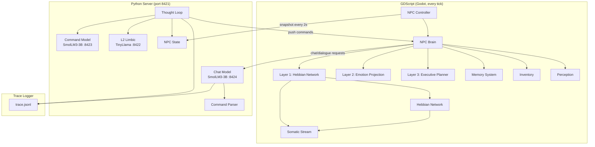

## 2. Per-Tick Client Loop

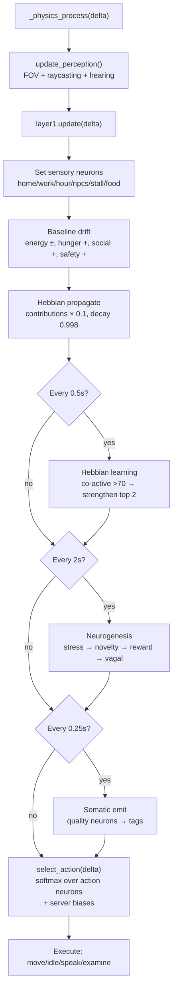

## 3. Hebbian Network — Neuron Types

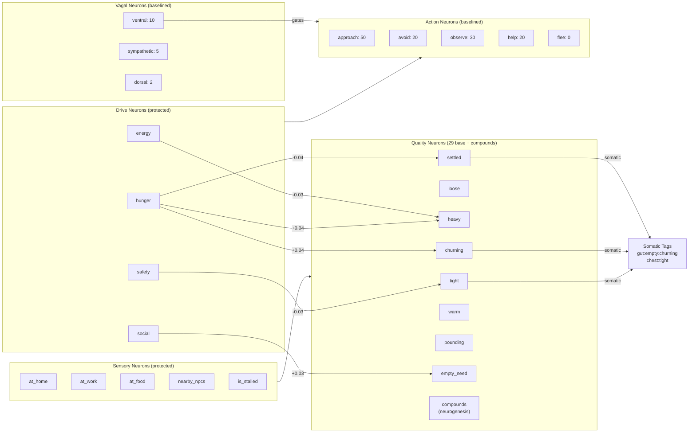

## 4. Somatic Stream — Tag Emission

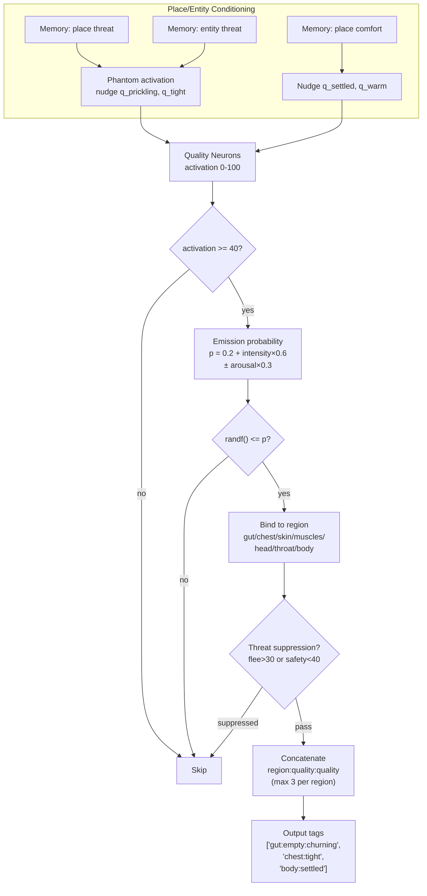

## 5. Snapshot → Server → Push Commands

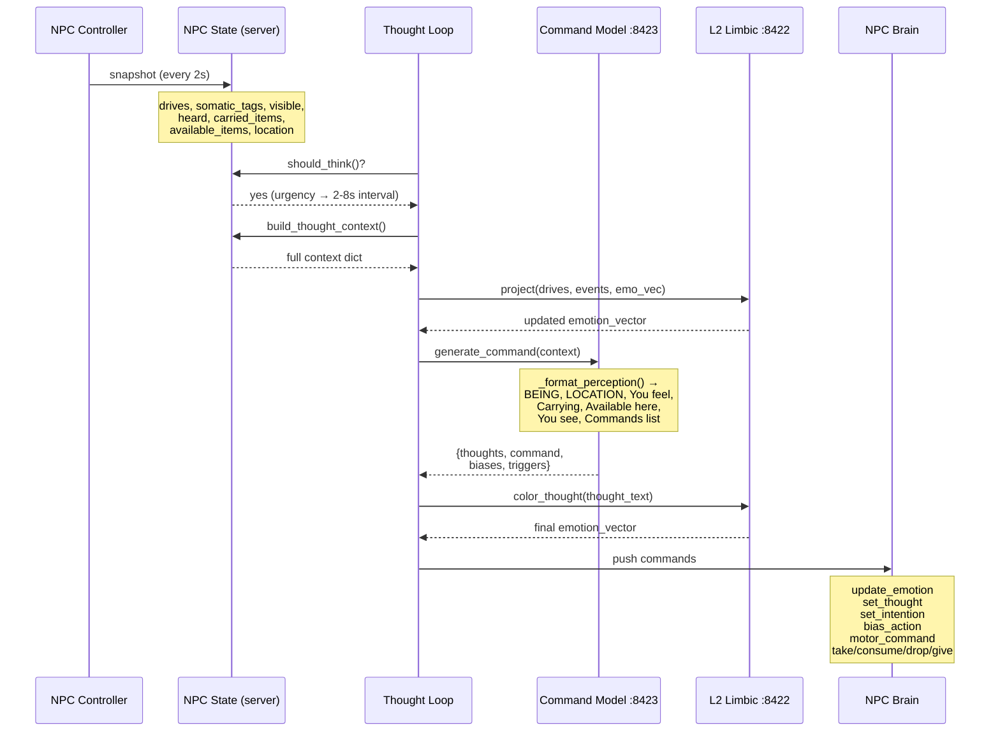

## 6. Command Model Prompt → Parse → Action

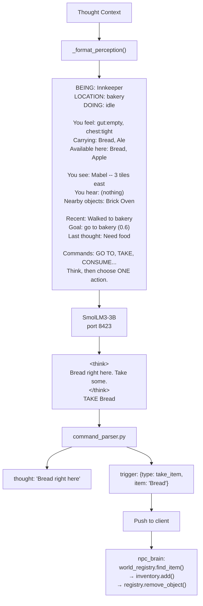

## 7. Chat / Dialogue Flow

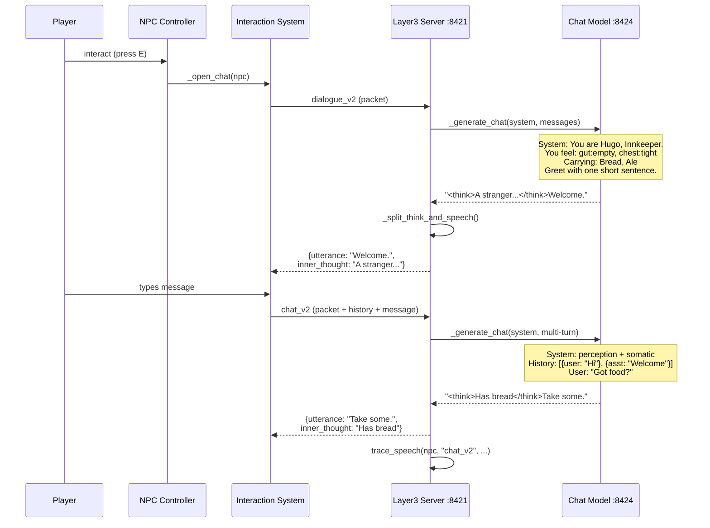

## 8. Inventory Flow

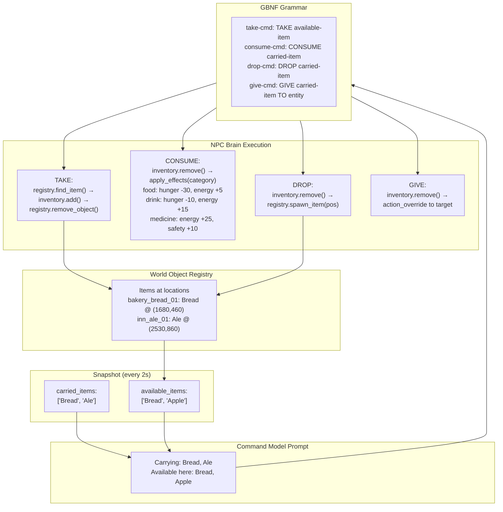

## 9. Trace Logger — Event Types

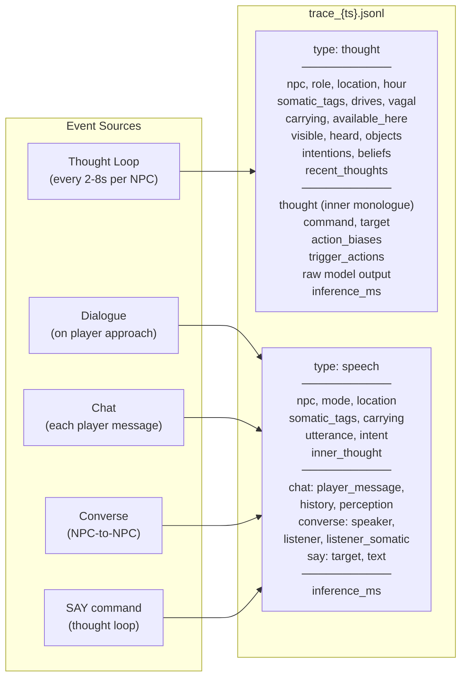

## 10. Cadence Reference

```mermaid
gantt
    title Component Cadences (1 second = 1 unit)
    dateFormat X
    axisFormat %S

    section Per Tick (60fps)
    Perception          :a, 0, 1
    L1 Propagate        :b, 0, 1
    L1 Modulation       :c, 0, 1
    Action Selection    :d, 0, 1

    section Sub-second
    Somatic Emit (0.25s):e, 0, 4
    Hebbian Learn (0.5s):f, 0, 2

    section Seconds
    Snapshot Send (2s)  :g, 0, 8
    Neurogenesis (2s)   :h, 0, 8
    Thought Cycle (2-8s):i, 0, 16
    L2 Limbic (5s)      :j, 0, 20

    section Minutes
    L3 Replan (30 game-min) :k, 0, 60
```

## 11. Neurogenesis Cascade

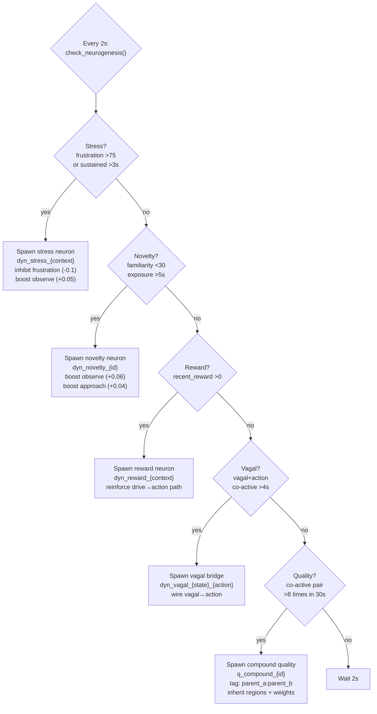
